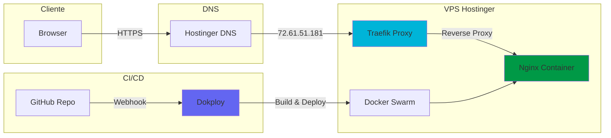

# Perfil Profissional - Marcelo Jr

[](https://astro.build/)
[](https://tailwindcss.com/)
[](https://www.typescriptlang.org/)
[](https://www.docker.com/)
[](https://opensource.org/licenses/MIT)

**Site:** [marcelojr.com.br](https://marcelojr.com.br)

Site pessoal que apresenta meu perfil profissional como Arquiteto de Soluções e Engenheiro Backend.

## Arquitetura



### Fluxo de Deploy

1. Push no GitHub (`main` branch)
2. Webhook dispara build no Dokploy
3. Docker multi-stage build (Node → Nginx Alpine)
4. Deploy via Docker Swarm
5. Traefik roteia tráfego com SSL (Let's Encrypt)

## Tecnologias Utilizadas

| Camada | Tecnologias |
|--------|-------------|
| Frontend | Astro 5.x, Tailwind CSS 4.x, TypeScript |
| Container | Docker (multi-stage), Nginx Alpine |
| Infra | VPS Hostinger, Dokploy, Traefik, Let's Encrypt |
| CI/CD | GitHub Webhooks, Auto Deploy |

## Funcionalidades

- Hero Section com apresentação profissional
- Bento Grid com stack, localização e GitHub Stats
- Seção de Case Studies (projetos e entregas)
- Skill Layers por camadas (Cloud, Backend, DevOps)
- Página de Currículo detalhado
- Versão PDF otimizada para impressão
- Certificações AWS com badges verificáveis
- Design responsivo e dark mode
- SEO otimizado (Open Graph, Twitter Cards)

## Como executar localmente

```bash
# Instalar dependências
npm install

# Rodar em desenvolvimento
npm run dev

# Build para produção
npm run build

# Preview do build
npm run preview
```

### Com Docker

```bash
# Build da imagem
docker build -t professional-site .

# Rodar container
docker run -p 8080:80 professional-site

# Acessar em http://localhost:8080
```

## Estrutura do Projeto

```text
├── src/
│   ├── components/     # Componentes Astro
│   ├── layouts/        # Layout base com SEO
│   ├── pages/          # Páginas do site
│   └── styles/         # Estilos globais
├── public/             # Assets estáticos
├── Dockerfile          # Multi-stage build
├── nginx.conf          # Config do Nginx
└── docker-compose.yml  # (opcional) Dev local
```

## Deploy

| Ambiente | URL | Método |
|----------|-----|--------|
| Produção | [marcelojr.com.br](https://marcelojr.com.br) | Dokploy + Docker Swarm |
| Preview | [GitHub Pages](https://jrmarcello.github.io/professional-site/) | GitHub Actions |

## Licença

Este projeto está sob a licença MIT.

## Contato

- LinkedIn: [Marcelo Jr](https://www.linkedin.com/in/marcelo-jr-9698874a)
- GitHub: [jrmarcello](https://github.com/jrmarcello)
- Email: [marcello.dudk@gmail.com](mailto:marcello.dudk@gmail.com)
